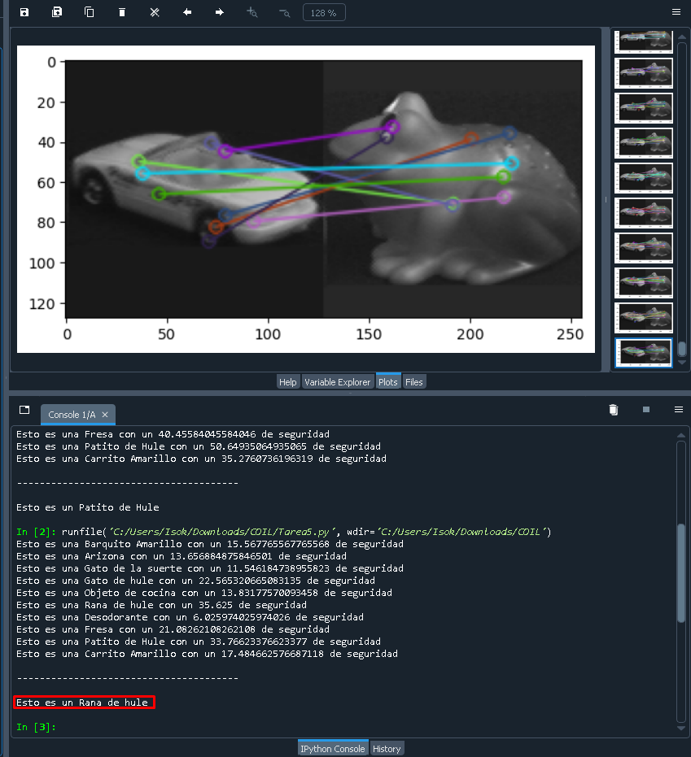

# Deteccion de Objetos utilizando el algortmo SIFT

<h3>Este programa utiliza la tecnica de "Brute-Force Matching with ORB Descriptors", detallada en la parte de abajo:</h3>

<h4> *Brute-Force Matching with ORB Descriptors*</h4>

Here, we will see a simple example on how to match features between two images. In this case, I have a queryImage and a trainImage. We will try to find the queryImage in trainImage using feature matching. ( The images are /samples/data/box.png and /samples/data/box_in_scene.png)

We are using ORB descriptors to match features. So let's start with loading images, finding descriptors etc.

<h5>Import Values</h5>

import numpy as np
import cv2 as cv
import matplotlib.pyplot as plt
 
img1 = cv.imread('box.png',cv.IMREAD_GRAYSCALE)          # queryImage
img2 = cv.imread('box_in_scene.png',cv.IMREAD_GRAYSCALE) # trainImage
 
<h5> Initiate ORB detector </h5>
orb = cv.ORB_create()
 
#find the keypoints and descriptors with ORB
kp1, des1 = orb.detectAndCompute(img1,None)
kp2, des2 = orb.detectAndCompute(img2,None)
Next we create a BFMatcher object with distance measurement cv.NORM_HAMMING (since we are using ORB) and crossCheck is switched on for better results. Then we use Matcher.match() method to get the best matches in two images. We sort them in ascending order of their distances so that best matches (with low distance) come to front. Then we draw only first 10 matches (Just for sake of visibility. You can increase it as you like)

#####  create BFMatcher object
bf = cv.BFMatcher(cv.NORM_HAMMING, crossCheck=True)
 
##### Match descriptors.
matches = bf.match(des1,des2)
 
##### Sort them in the order of their distance.
matches = sorted(matches, key = lambda x:x.distance)
 
###### Draw first 10 matches.
img3 = cv.drawMatches(img1,kp1,img2,kp2,matches[:10],None,flags=cv.DrawMatchesFlags_NOT_DRAW_SINGLE_POINTS)
 
plt.imshow(img3),plt.show()

### Adaptando esto, obtenemos:

# Funcionalidad del codigo:

